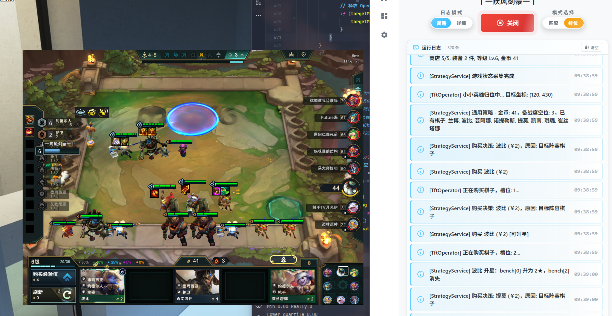
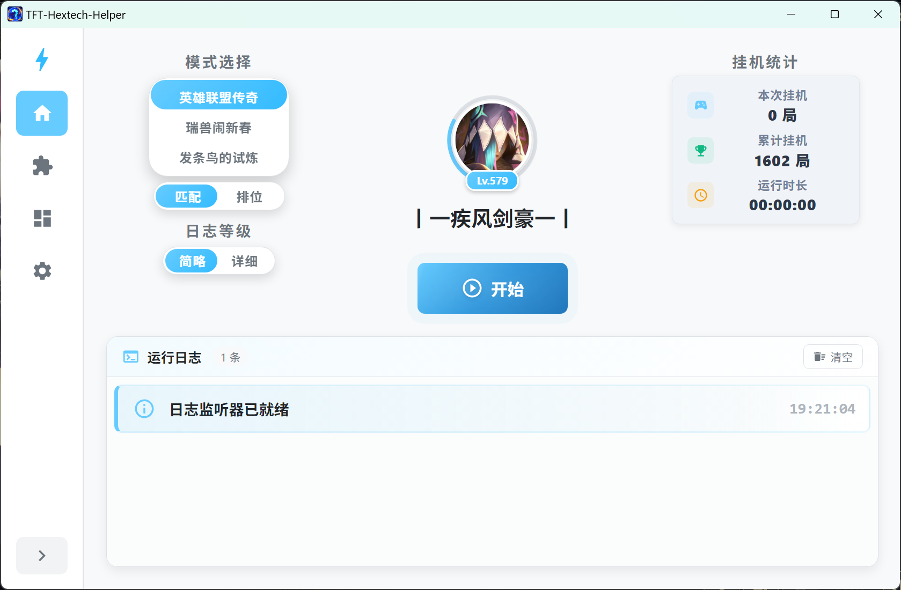
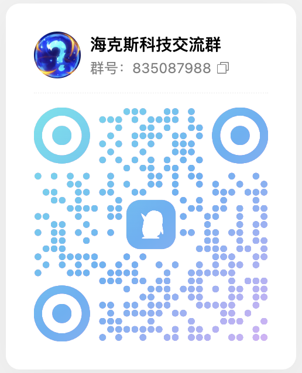

# TFT-Hextech-Helper —— 云顶之弈挂机小助手

<!-- PROJECT SHIELDS -->

 

  
  &nbsp;
  
  &nbsp;
  
  &nbsp;
  
  &nbsp;
  

  

<!-- PROJECT LOGO -->

  
  <h1 align="center">TFT Hextech Helper</h1>
  

     
    <a href="https://github.com/WJZ-P/TFT-Hextech-Helper">查看Demo</a>
    ·
    <a href="https://github.com/WJZ-P/TFT-Hextech-Helper/issues">报告Bug</a>
    ·
    <a href="https://github.com/WJZ-P/TFT-Hextech-Helper/issues">提出新特性</a>
  

  

<h2 align="center">"尽握在手沉重的花束名誉&nbsp;沾着泥土的指尖始终&nbsp;怯于靠近&nbsp;那脸庞遥不可及"</h2>

## 目录

- [TFT Hextech Helper](#tft-hextech-helper)
    - [目录](#目录)
    - [项目简介](#项目简介)
    - [功能特性](#功能特性)
    - [使用教程](#使用教程)
    - [获取更新](#获取更新)
    - [交流渠道](#交流渠道)
    - [技术栈](#技术栈)
    - [版权说明](#版权说明)
    - [鸣谢](#鸣谢)
    - [重要声明](#重要声明)

## 项目简介

TFT Hextech Helper 是一款基于 Electron + React + TypeScript 开发的云顶之弈自动下棋助手。它可以帮助你在云顶之弈(包括S16英雄联盟传奇、S4.5瑞兽闹新春、发条鸟的试炼)中自动进行对局，解放你的双手，让你可以边挂机边做其他事情。（当然挂机的时候你就不能玩电脑了，因为软件会使用你的鼠标！）

  

## ⚠️ 注意事项

- **必须以管理员身份运行**，否则无法正常控制游戏
- **游戏语言必须设置为简体中文**，否则软件无法正确识别棋子
- **推荐使用默认棋盘皮肤**，已针对默认棋盘优化，能加快棋子识别速度
- 支持**Windows & MacOS**
- 暂不支持外服。

## 功能特性

- 🎮 **自动下棋** - 智能识别游戏状态，自动购买英雄、整理阵容
- 🎯 **阵容推荐** - 内置多套热门阵容配置，一键选择
- ⌨️ **快捷键控制** - F1 开启/关闭挂机，F2 本局结束后停止
- 🎨 **现代化界面** - 美观的 UI 设计，超级酷
- 📊 **实时日志** - 查看详细的运行日志，了解程序状态

## 使用教程

### 1. 下载并安装

从 [Release](https://github.com/WJZ-P/TFT-Hextech-Helper/releases) 页面下载最新版本：
- **安装版** (.exe setup) - 不推荐，走正常软件安装流程，会留注册表
- **便携版** (.zip) - 推荐，解压即用，无需安装

**或点击右侧高速下载**：[TFT-Hextech-Helper-1.0.0-win.zip](https://static1.keepcdn.com/user-avatar/2026/01/17/22/6943f6affbbe480001c744e2/ciallo/82672950ad9b996250910d6919e85631_TFT-Hextech-Helper-1.0.0-win.zip)

### 2. 启动软件

> ⚠️ **重要**：本软件需要**以管理员身份运行**才能正常工作！目前只支持Windows系统运行。

  

### 3. 连接游戏客户端

启动英雄联盟客户端，软件会自动检测并连接。如果出现打开了客户端却显示未连接的情况，请检查是否使用管理员模式启动软件！

<!-- TODO: 添加连接成功截图 -->

### 4. 开始挂机

1. 选择你想要的阵容配置
2. 点击"开始挂机"按钮或按 **F1** 快捷键
3. 程序会自动开始匹配并进行对局

### 快捷键说明

| 快捷键 | 功能 |
|:------:|:----:|
| F1 | 开启/关闭挂机 |
| F2 | 本局结束后自动停止 |

## 获取更新

#### [前往 Release 页面](https://github.com/WJZ-P/TFT-Hextech-Helper/releases)

## 交流渠道

  

## 技术栈

- **前端框架**: React 18 + TypeScript
- **桌面框架**: Electron 32
- **构建工具**: electron-vite
- **UI 组件**: MUI (Material-UI) + styled-components
- **图像识别**: OpenCV.js + Tesseract.js
- **自动化**: nut-js (鼠标键盘控制)

## 版权说明

本项目采用 **CC BY-NC-ND 4.0** 协议，这意味着：

- ✅ 可以下载、使用、分享（需注明出处）
- ❌ **禁止**商业使用
- ❌ **禁止**二次开发/修改后发布

详情请参阅 [LICENSE](https://github.com/WJZ-P/TFT-Hextech-Helper/blob/main/LICENSE)

## 鸣谢

- 感谢所有为这个项目提供建议和反馈的朋友们

## 重要声明

### 本项目仅供学习交流使用，**禁止**用于任何商业用途！使用本软件产生的任何后果由用户自行承担。(｡•́︿•̀｡)

## 📝 To Do List

- [x] **基础挂机功能**

- [x] **阵容配置系统**

- [x] **快捷键支持**

- [x] **更多阵容配置**

- [x] **支持自定义阵容**

- [x] **对局显示人机信息**

- [ ] **战绩统计**

## 如果您喜欢本项目，请给我点个⭐吧(๑>◡<๑)！

## ⭐ Star 历史

---

<b>另一条时间线</b>

 

  

<i>"但至少在这里，他们在一起。"</i>

<!-- 时至今日，你依然在我的梦境中挥之不去。 -->

[contributors-shield]: https://img.shields.io/github/contributors/WJZ-P/TFT-Hextech-Helper.svg?style=flat-square
[contributors-url]: https://github.com/WJZ-P/TFT-Hextech-Helper/graphs/contributors
[forks-shield]: https://img.shields.io/github/forks/WJZ-P/TFT-Hextech-Helper.svg?style=flat-square
[forks-url]: https://github.com/WJZ-P/TFT-Hextech-Helper/network/members
[stars-shield]: https://img.shields.io/github/stars/WJZ-P/TFT-Hextech-Helper.svg?style=flat-square
[stars-url]: https://github.com/WJZ-P/TFT-Hextech-Helper/stargazers
[issues-shield]: https://img.shields.io/github/issues/WJZ-P/TFT-Hextech-Helper.svg?style=flat-square
[issues-url]: https://img.shields.io/github/issues/WJZ-P/TFT-Hextech-Helper.svg
[license-shield]: https://img.shields.io/github/license/WJZ-P/TFT-Hextech-Helper.svg?style=flat-square
[license-url]: https://github.com/WJZ-P/TFT-Hextech-Helper/blob/main/LICENSE
